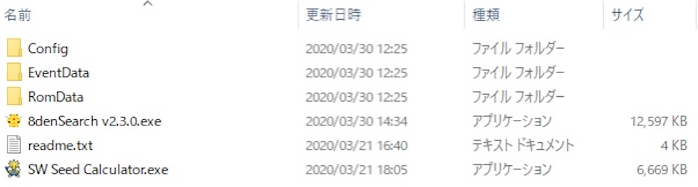
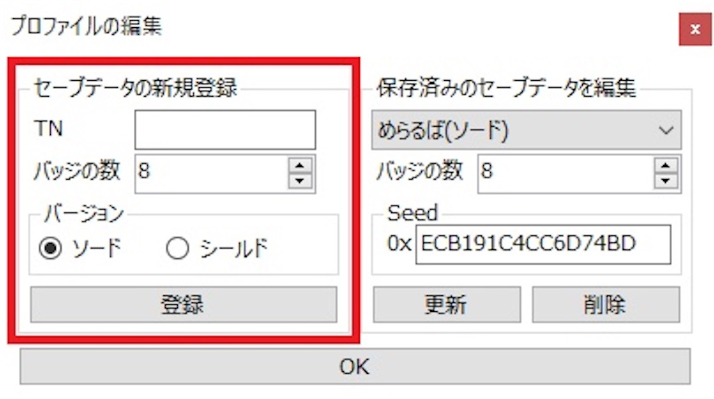
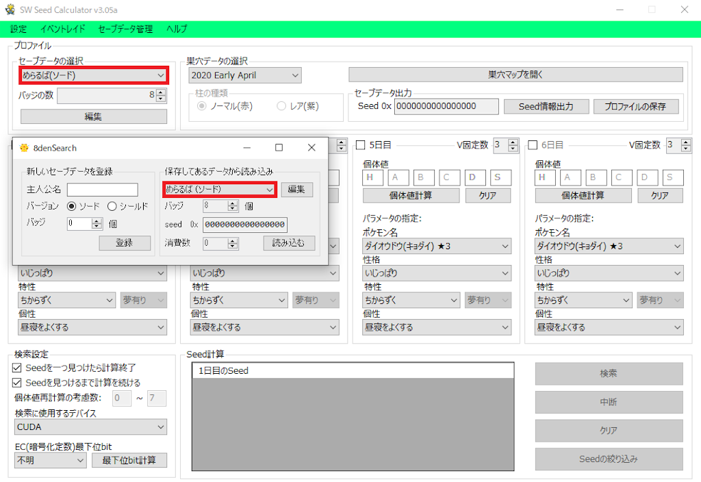
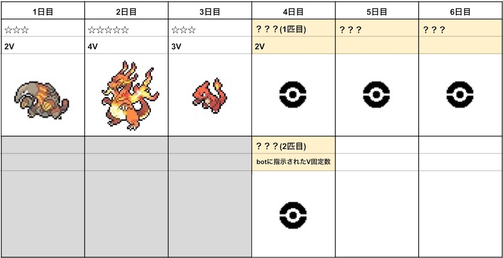
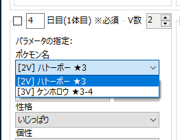
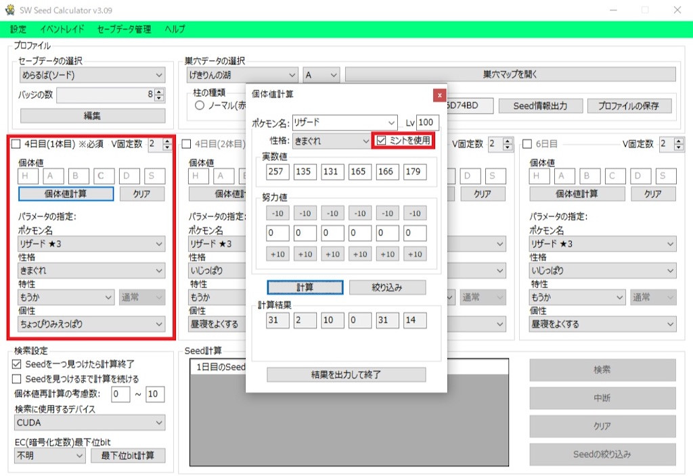
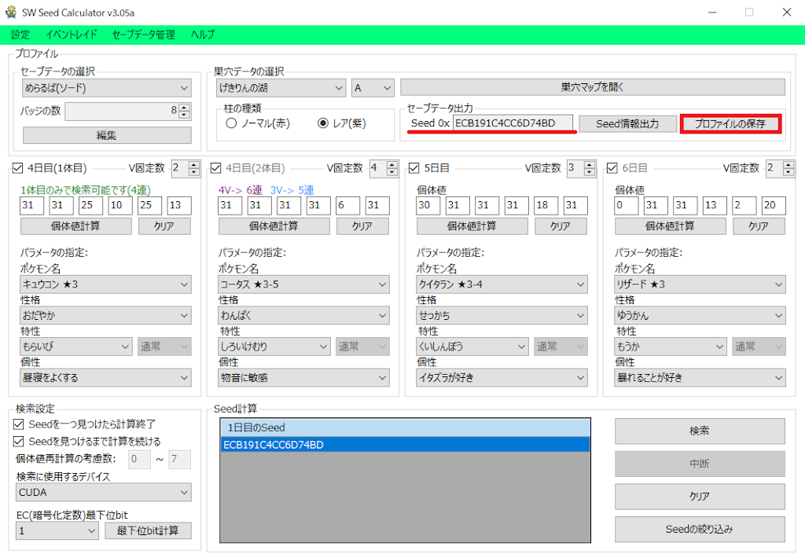
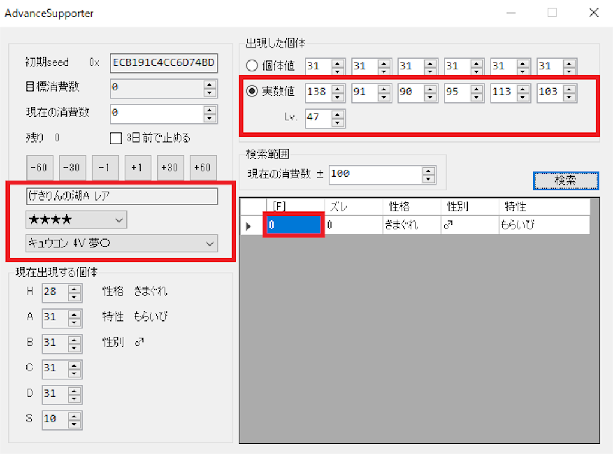
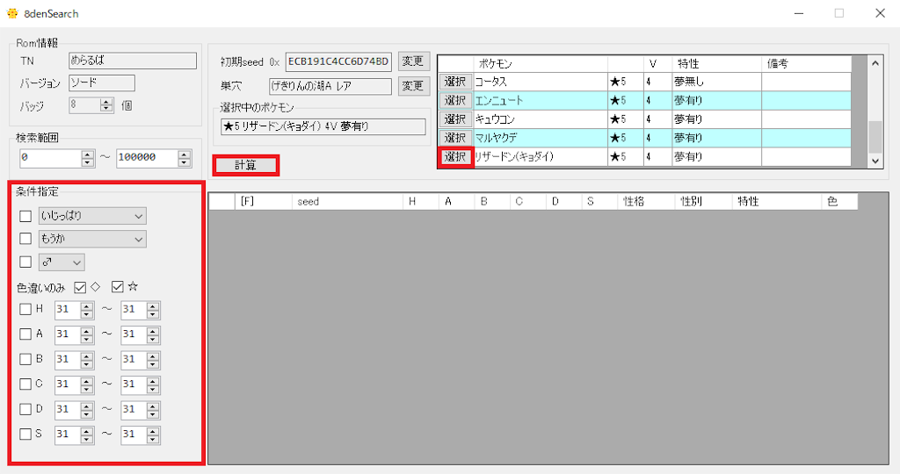
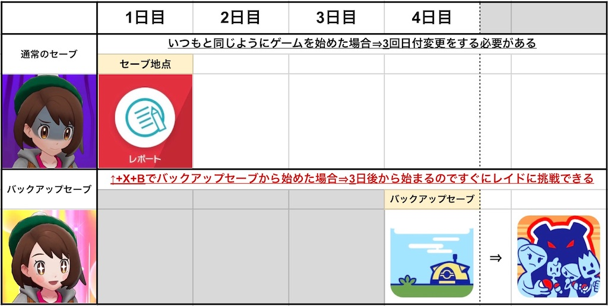

# レイド乱数調整

レイド乱数調整とは、ポケモンソード・シールドに登場するマックスレイドバトルで、任意の個体値や色違いなどのポケモンを出現させる乱数調整です。

## 前提知識

- 個体値の特定方法

- 時渡り

- チートモード(ランクマバグ)

- キャンプバックアップ

## 必要なもの

- [SW Seed Calculator](https://bzl.hatenablog.com/entry/2020/01/05/212130)

- [8denSearch](https://note.com/sub_827/n/nfafc7b0ae371)

## ツールのセットアップ

SW Seed Calculatorのフォルダに8denSearchの.exeファイルをコピーします。
これにより、プロファイルやイベントデータを共有することができます。



SW Seed Calculatorを開き、```プロファイルの編集```から乱数調整を行うデータの情報を入力し、登録します。



同じフォルダにコピーした8denSearchを開き、先ほど登録したデータが読み込めているか確認します。
読み込めていれば8denSearchを閉じます。



- イベントレイドの更新
    『イベントレイド』→『更新』
    これを行うことで、<strong>SW Seed Calculatorと8denSearchどちらにも最新のイベントデータを追加することができる。</strong>

## 1. 出現させたいポケモンを決める

[ポケモン徹底攻略](https://yakkun.com/swsh/raid.htm)などを参考に、乱数調整したいポケモンが出現する巣穴とレア度を確認しましょう。
巣穴まで移動し、ねがいのかたまりを投げ込んで光の柱を出します。[^1]

## 2. 基準seed特定

レポートした日を1日目として、4日目以降に出現するポケモンの個体値を特定してツールに入力することで、基準seedを特定します。



<strong>以降、seed特定が終わるまでは指示された場所以外ではレポートを書かないでください。</strong>

### 4日目(1体目)

1. SW Seed Calculatorを開き巣穴データを目的の巣穴に設定した後、ポケモン名のリストからVが最も少ないポケモンを選択します。



2. 3回時渡りをし、4日目に該当のポケモンが出るまで厳選します。

3. 該当のポケモンが出たら捕獲し、赤枠内の必要なパラメータを特定してSW Seed Calculatorに入力しリセットします。(SW Seed Calculatorで実数値やミント使用での個体値特定ができます。)



   3. 4日目(2体目)に6連or5連と表示されたら4日目(2体目)に進みます。

   3. 3連or4連、もしくは表示されない場合は、リセット後に時渡りを1回行った後にレポートし1.からやり直します。

### 4日目(2体目)

1. 4日目(1体目)でSW Seed Calculatorに指示されたV数のポケモンを選択します。

2. 3回時渡りをし、4日目に該当のポケモンが出るまで厳選します。

3. 該当のポケモンが出たら捕獲し、必要なパラメータをSW Seed Calculatorに入力しリセットします。

### 5日目

1. 4回時渡りをし、5日目のポケモンを捕獲します。

2. 必要なパラメータをSW Seed Calculatorに入力しリセットします。

### 6日目

1. 5回時渡りをし、6日目のポケモンを捕獲します。

2. 必要なパラメータをSW Seed Calculatorに入力しリセットします。

## 3. seed検索

必要な情報を全て入力したら、自身の環境にあった```検索に使用するデバイス```を選択し、検索ボタンを押します。

```
『検索に使用するデバイス』
CPU(100%):CPUをフルに使用する。
CPU(50%)CPUの最大スレッド数の半分を使用する。
OpenCL:GPUを使用する。
CUDA:Nvidia製GPUでのみ使用できる。OpenCLと同様GPUを使用するがこちらの方が速い。
```

[【SwSh】ポケモン剣盾 レイド乱数調整用ツール SW Seed Calculatorの使い方](https://bzl.hatenablog.com/entry/2020/01/05/212130)より引用

seed検索が終わったら出力されたseedをダブルクリックし、```セーブデータ出力```に反映されたことを確認したら、```プロファイルの保存```をします。



8denSearchを開いて今回使用したデータを選択するとseedが反映されているので、読み込むを押して次に進みます。

### 求めたseedが正しいか確認する

8denSearchを開いたら```計算```を押し、表示されたリスト内部をダブルクリックして```AdvanceSupporter```を開きます。
時渡りをせず1日目のポケモンを捕獲し、```レア度、種族、実数値、レベル```を入力し、検索をします。
```[F]```が0の個体がヒットすれば求めたseedが正しいと言えます。



## 4. 目標個体の決定と乱数消費

目的のポケモンを```選択```し、条件指定をしたら```計算```を押します。



表示されたリストから狙う個体を選び、ダブルクリックして```AdvanceSupporter```を開きます。

### 乱数消費

```3日前で止める```にチェックが入っていることを確認し、残り消費数分だけ消費します。[^2]

### 高速消費のやり方

1. ポケモンセンターなど、建物内に移動する[^3]

2. チートモードに入る

3. ゲームへ戻らず時渡りを繰り返す[^4]

3日前まで消費が終わったらセーブをして、時渡りをせず1日目のポケモンを捕獲し、```レア度、種族、実数値、レベル```を入力し、```検索```をし、その後リセットします。
ズレが0の個体がヒットすれば消費作業は終了です。足りなかった場合はその分だけ消費します。

### 5. 目当てのポケモンが出るまで厳選する

乱数調整の手順は終わったので、最後に目当てのポケモンが出るまで厳選をします。
3回時渡りをし、4日目のレイドが目当てのポケモンになるまで厳選を繰り返します。目当てのポケモンがでたら、その巣穴に他に欲しいポケモンがいないならセーブして良いですが、他に欲しいポケモンがいる場合はキャンプバックアップを使用します。



目的の個体が光れば成功です。お疲れさまでした。


[^1]: 自然発生したレイドは、日付が更新されるとその位置と内容が変わってしまうため乱数調整ができません。
[^2]: このとき多少余裕を持って消費し、最後に微調整することを推奨します。
[^3]: ワイルドエリアで消費作業をすると、ゲームが落ちてしまう事があります。
[^4]: 1月などの31日まである月の日だけ変更し、1周ごとに30消費とカウントすると数えやすいので推奨します。